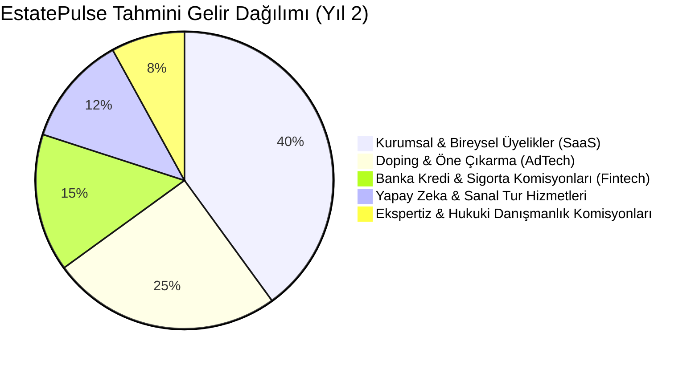

# 💰 EstatePulse - Gelir Modelleri (Monetization) ve İş Stratejisi

EstatePulse; sadece geleneksel ilan listeleme ücretlerine dayanmayan, **Yapay Zeka Servisleri (AI-as-a-Service)**, **Finansal Teknoloji (Fintech)** entegrasyonları ve **Katma Değerli Gayrimenkul Hizmetleri** ile çeşitlendirilmiş hibrit ve yüksek marjlı bir gelir mimarisine sahiptir.

---

## 1. Gelir Akışlarının Dağılımı (Revenue Pillars)

---

## 2. Üyelik ve Abonelik Modelleri (Subscription SaaS)

### 2.1. Danışman & Emlak Ofisi (Acente) Paketleri

| Paket | Aylık Ücret | İlan Kotası | Öne Çıkan Ayrıcalıklar |
| :--- | :--- | :--- | :--- |
| **Starter (Bağımsız Danışman)** | 1.490 ₺ | 15 Aktif İlan | Standart AVM değerleme raporu, Temel CRM, 2 adet AI Vitrin dopingi. |
| **Pro Agent (Büyüyen Danışman)** | 3.250 ₺ | 50 Aktif İlan | Sınırsız AI AVM raporu, 10 adet AI Virtual Staging kredisi, Öncelikli Lead dağıtımı, WhatsApp CRM entegrasyonu. |
| **Enterprise Brokerage (Ofis)** | 8.900 ₺+ | 200+ İlan | Çoklu danışman yönetimi (10+ hesap), Matterport 3D entegrasyonu, Özel ofis mikro-sitesi, API erişimi, Dedicated Müşteri Yöneticisi. |

### 2.2. Bireysel Mülk Sahibi Üyelikleri
- **Standart İlan (Freemium):** İlk ilan 30 gün boyunca ücretsiz. (Doğrulanmış mülk sahibi kimliği şartıyla).
- **Pro Sahibinden Paketi (790 ₺):** 
  - Kapsamlı AI Değerleme & Emsal Satış Raporu.
  - 3 Odaya kadar ücretsiz AI Virtual Staging (Sanal Mobilyalama).
  - İlan süresince 1 hafta Vitrin Dopingi.

---

## 3. Doping & Öne Çıkarma Seçenekleri (AdTech)

İlanların görüntülenme ve dönüşüm oranlarını katlamak için geliştirilen performans odaklı doping seçenekleri:

1. **AI Top Pick (Akıllı Algoritma Vitrini) - 590 ₺ / Hafta:**
   - İlan, NLP arama motorunda benzer arama yapan en nitelikli alıcı adaylarının arama sonuçlarında en üstte ve "AI Eşleşme Skoru: %98" etiketiyle çıkar.
2. **Ana Sayfa & Bölge Vitrini - 750 ₺ / Hafta:**
   - İlanın bağlı olduğu ilçe aramasında en üst sabit sırada ve ana sayfa kayan vitrinde gösterim.
3. **Acil / Fırsat İlanı Rozeti - 390 ₺ / Hafta:**
   - İlan kartında dikkat çekici kırmızı acil rozeti ve "Fiyatı Bölge Ortalamasından Uygun" vurgusu.
4. **Harita İğnesi Vurgulama (Map Pin Glow) - 290 ₺ / Hafta:**
   - Mapbox haritasında diğer pinlerden 2 kat büyük, logolu ve animasyonlu parlayan pin.
5. **Bölgesel Push & E-posta Bildirimi (Smart Blast) - 950 ₺ / Seferlik:**
   - O mahallede son 30 günde arama yapmış veya favoriye ilan eklemiş en az 2.500 aktif alıcıya anlık bildirim gönderimi.

---

## 4. Banka Kredi & Sigorta İş Ortaklığı (Fintech Entegrasyonu)

EstatePulse, kullanıcı henüz ilan sayfasındayken kredi ve sigorta ihtiyaçlarını çözerek yönlendirme (Lead Generation & Referral Fee) geliri elde eder:

- **Konut Kredisi Yönlendirme Komisyonu:**
  - Anlaşmalı bankalar (İş Bankası, Garanti BBVA, Yapı Kredi, Akbank vb.) ile doğrudan API entegrasyonu.
  - Kullanıcı ilan detayından "Krediye Başvur" dediğinde ön onaylı başvuru bankaya iletilir.
  - **Gelir Modeli:** Kullandırılan kredi hacmi üzerinden **%0.40 - %0.75** arası başarı komisyonu. (Örn: 3.000.000 TL kredi için 15.000 - 22.500 TL net gelir).
- **Zorunlu Deprem Sigortası (DASK) & Konut Sigortası:**
  - Satış ve kiralama aşamasında tek tıkla dijital poliçe teklifi.
  - Kesilen her poliçe üzerinden **%15 - %25** acente komisyonu.

---

## 5. Değer Katılmış Hizmetler & Yapay Zeka Servis Satışı

1. **AI Virtual Staging (Sanal Mobilyalama Kredi Paketleri):**
   - Emlakçılar ve mülk sahipleri için ekstra oda fotoğraflarını mobilyalama hizmeti:
     - 5 Fotoğraf: 250 ₺
     - 20 Fotoğraf: 800 ₺
     - 50 Fotoğraf (Kurumsal): 1.600 ₺
2. **Resmi Lisanslı SPK Gayrimenkul Değerleme (Ekspertiz):**
   - Platform içi AI değerlemesi yetmeyen ve banka kredisi/miras/yatırım için resmi SPK onaylı eksper raporu isteyen kullanıcılara yönlendirme.
   - Anlaşmalı lisanslı değerleme şirketlerinden işlem başına **%20** aracılık komisyonu.
3. **Profesyonel 3D Matterport & Drone Çekim Hizmeti:**
   - Lüks segment ilanlar için yerinde çekim organizasyonu (EstatePulse Creator Network üzerinden serbest fotoğrafçılarla pazar yeri modeli).
