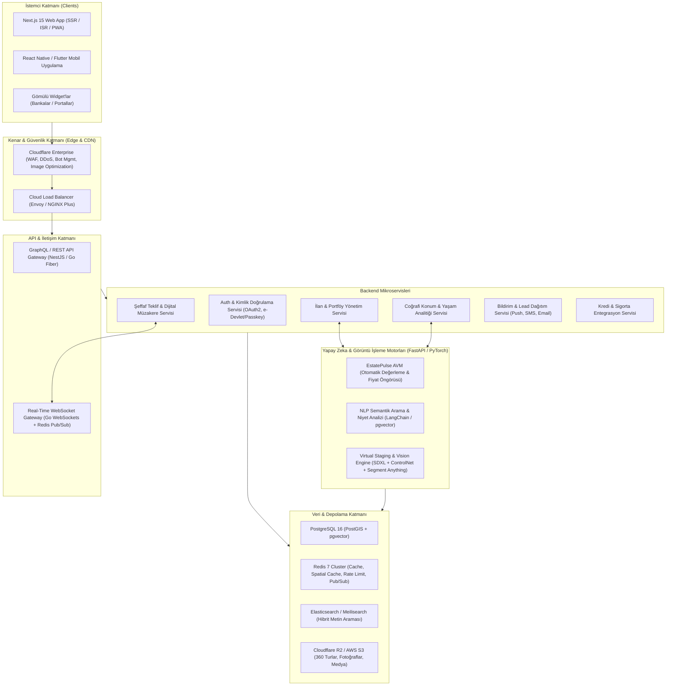
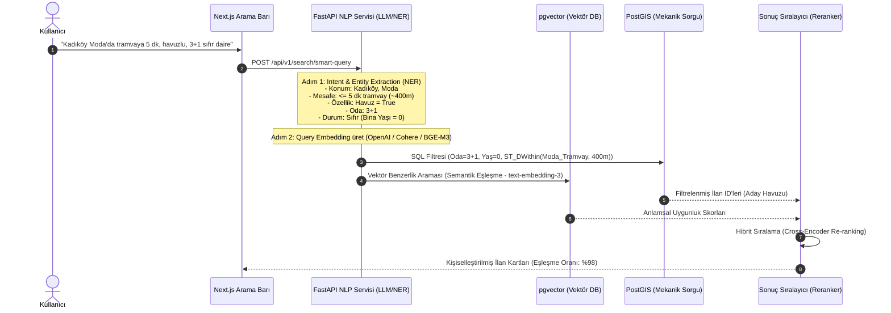

# 🏗️ EstatePulse - Sistem Mimarisi ve Teknik İster Dokümanı

Bu doküman, EstatePulse platformunun yüksek ölçeklenebilirlik, düşük gecikme süresi, yüksek coğrafi veri işleme kabiliyeti ve gelişmiş yapay zeka modüllerini destekleyen uçtan uca teknik mimarisini detaylandırır.

---

## 1. Yüksek Düzey Sistem Mimarisi (High-Level Architecture)

---

## 2. Teknoloji Yığını (Tech Stack)

| Katman | Teknoloji | Seçim Gerekçesi |
| :--- | :--- | :--- |
| **Frontend Framework** | **Next.js 15 (React 19, App Router)** | Mükemmel SEO performansı, Server-Side Rendering (SSR) ve Incremental Static Regeneration (ISR) ile dinamik ilan sayfalarında 50ms altı TTFB. |
| **Styling & UI** | **Tailwind CSS v4 + Radix UI + Framer Motion** | Tasarım sistemi tutarlılığı, erişilebilirlik (A11y - WCAG AAA uyumlu) ve 60 FPS akıcı geçiş animasyonları. |
| **Harita Kütüphanesi** | **Mapbox GL JS / MapLibre + Deck.gl** | 100.000+ eşzamanlı konumsal veriyi GPU hızlandırmalı kümeleme (clustering) ve 3D bina/arazi katmanlarıyla kesintisiz render etme. |
| **State & Cache (Web)** | **TanStack Query (React Query) + Zustand** | Sunucu durumu senkronizasyonu, akıllı önbellekleme ve hafif istemci durumu yönetimi. |
| **Core Backend** | **Node.js (NestJS) / Go (Golang Fiber)** | Kurumsal modüler mimari, tip güvenliği (TypeScript) ve mikroservisler arası yüksek eşzamanlı I/O verimliliği. |
| **AI / ML Backend** | **Python (FastAPI, PyTorch, LightGBM, CatBoost)** | Makine öğrenmesi kütüphaneleriyle yerel uyumluluk, asenkron REST/gRPC sunucusu, GPU desteği. |
| **Ana Veritabanı** | **PostgreSQL 16 + PostGIS + pgvector** | Coğrafi sorgulamalar (ST_DWithin, ST_Intersects, Voronoi hücreleri) ve vektör benzerlik aramaları için sektör standardı ACID veritabanı. |
| **Hafıza İçi Önbellek** | **Redis 7 Cluster** | Coğrafi yarıçap önbelleği (GEOSEARCH), oturum yönetimi, token kova hız kısıtlama ve WebSocket Pub/Sub. |
| **Arama Motoru** | **Meilisearch / OpenSearch** | Tip-öngörülü (type-as-you-go), typo-tolerant ve BM25 + Vektör hibrit arama kabiliyeti. |
| **Medya Depolama** | **Cloudflare R2 + Fastly / Cloudflare Images** | Çıkış (egress) ücreti olmayan S3 uyumlu depolama; anlık WebP/AVIF format dönüştürme ve görsel optimizasyonu. |

---

## 3. Yapay Zeka & Makine Öğrenmesi Mimarisi

### 3.1. EstatePulse AVM (Automated Valuation Model)
Zillow'un Zestimate modelinin ötesine geçen hibrit bir değerleme mimarisi:

1. **Öznitelik Mühendisliği (Feature Engineering):**
   - **Yapısal Veriler:** Brüt/net m², oda sayısı, bina yaşı, banyo/balkon sayısı, kat, asansör, otopark, ısıtma türü, aidat.
   - **Konumsal & Çevresel İndeksler (Spatial Features):** 
     - En yakın metro, metrobüs, otobüs duraklarına yürüyüş mesafesi (PostGIS `ST_Distance`).
     - 1 km yarıçaptaki ortalama okul kalite skoru, yeşil alan oranı, kafe yoğunluğu, suç endeksi.
     - Bölgesel Zemin/Deprem Risk İndeksi (AFAD verileri ve MTA fay hattı mesafesi).
   - **Görsel Analiz (Computer Vision Feature Extraction):**
     - İlan fotoğrafları ResNet-50 / CLIP modeliyle taranarak mutfak, banyo ve salonun yenilenme durumu (lüks, standart, masraf gerektiren) tespit edilir ve puana (1-5 arası Condition Index) dönüştürülür.
   - **Makroekonomik Göstergeler:** Merkez bankası konut fiyat endeksi, güncel konut kredisi faiz oranları, bölgesel enflasyon.

2. **Algoritma Mimarisi:**
   - **Gradient Boosted Trees (CatBoost & LightGBM):** Tablosal ve kategorik veriler için ana tahminci.
   - **Spatial Autoregressive Hedonic Regression:** Coğrafi otokorelasyonu ve mahalle içi fiyat yayılma etkisini modeller.
   - **Topluluk Modeli (Ensemble Stacking):** CatBoost + Sinir Ağı (Deep Spatial Embedding) birleştirilerek nihai değer üretilir.
   - **Güven Aralığı (Confidence Band & SHAP):** Fiyat sadece tek bir rakam olarak değil; örneğin `%94 güven aralığı ile 6.450.000 TL - 6.850.000 TL` şeklinde sunulur. Fiyatı artıran/azaltan unsurlar SHAP değerleriyle kullanıcıya görselleştirilir.
   - **Prim Potansiyeli (Appreciation Forecast):** Prophet / LSTM modelleriyle 1 ve 3 yıllık gelecek getiri projeksiyonu.

### 3.2. Doğal Dil İşleme (NLP) Akıllı Arama Pipeline
Kullanıcının yazdığı serbest metin arama sorgusunu adım adım işler:

### 3.3. Sanal Tur & Generative AI Virtual Staging (Sanal Mobilyalama)
- **Problem:** Boş daireler alıcılar için soğuk ve hayal etmesi zordur; geleneksel mobilyalama binlerce dolar tutar.
- **Çözüm:** Kullanıcı veya emlakçı boş oda fotoğrafını yükler:
  1. **Segment Anything (SAM) & Depth Estimation:** Duvarlar, pencereler, parke zemin ve kapılar ayrıştırılır ve derinlik haritası (MiDaS) çıkarılır.
  2. **ControlNet (MLSD & Depth):** Odanın mimari perspektifi ve tavan/köşe hatları kilitlenir.
  3. **Diffusion Inpainting (SDXL):** Kullanıcının seçtiği stile göre (Modern, İskandinav, Minimalist, Bohem, Luxury) odaya ergonomik ölçülerde mobilyalar, halı, aydınlatma ve dekorasyon nesneleri fotogerçekçi ışıklandırma ile yerleştirilir.
  4. **Etkileşimli UI:** İlan sayfasında "Öncesi / Sonrası" kaydırıcı (Before/After Slider) ile anında görüntülenir.

---

## 4. Bölgesel Yaşam Analitiği & Harita Katmanı (15-Minute City Index)

Harita üzerinde Mapbox GL katmanları olarak dinamik sunulan skorlar:
- **Yürüyüş Skoru (WalkScore):** İlana yürüme mesafesindeki market, fırın, eczane ve sosyal yaşam alanlarının ağırlıklı yoğunluğu (0-100).
- **Ulaşım Skoru (TransitScore):** Raylı sistem, otobüs hatları, vapur iskeleleri frekansı ve mesafesi.
- **Eğitim Skoru (SchoolScore):** İlkokul, ortaokul, lise ve üniversite sınav başarı istatistikleri ve mesafe puanı.
- **Yeşil Yaşam & Park Skoru:** 10 dakikalık yürüme menzilindeki parklar, yeşil alanlar ve hava kalitesi endeksi (AQI).
- **Güvenlik & Zemin Riski:** Resmi deprem fay hattı haritası ve zemin sağlamlık katsayısı katmanı.

---

## 5. Şeffaf Teklif & Dijital Müzakere Motoru

Geleneksel emlak süreçlerindeki kayıt dışı ve şaibeli pazarlıkların önüne geçer:
- **Doğrulanmış Teklif:** Teklif vermek isteyen alıcı SMS / Kimlik onayı yapar ve opsiyonel olarak ön onaylı banka kredi mektubunu veya platform kaporasını (escrow) bağlar.
- **Zaman Kısıtlı Karşı Teklifler (Counter-Offers):** Satıcı, gelen teklifi 24-48 saatlik geri sayım sayacı eşliğinde doğrudan kabul edebilir, reddedebilir veya karşı teklif sunabilir.
- **Şeffaf İhale / Çoklu Teklif Modu (Opsiyonel):** Satıcı isterse "Açık Teklif Süreci" başlatabilir; alıcılar diğer teklif verenlerin kimliğini görmeden en yüksek teklif aralığını görerek adil rekabet edebilir.
- **Bağlayıcı Dijital Protokol:** Anlaşma sağlandığında sistem otomatik ön satış protokolü oluşturur ve her iki tarafa e-İmza bağlantısı gönderir.
