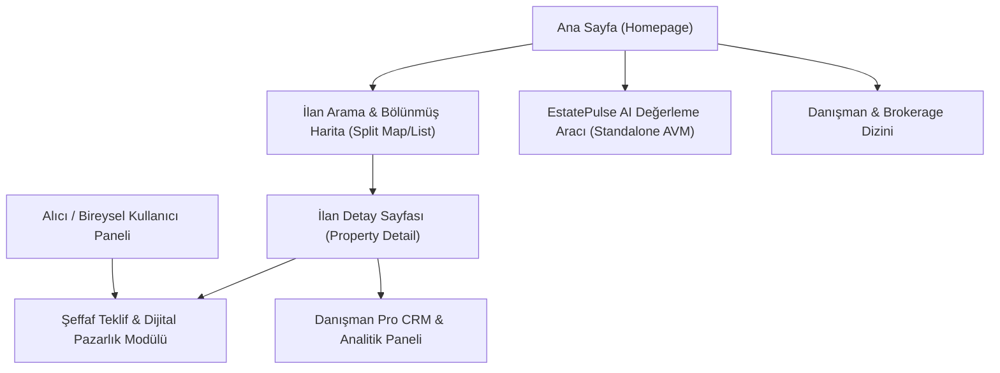
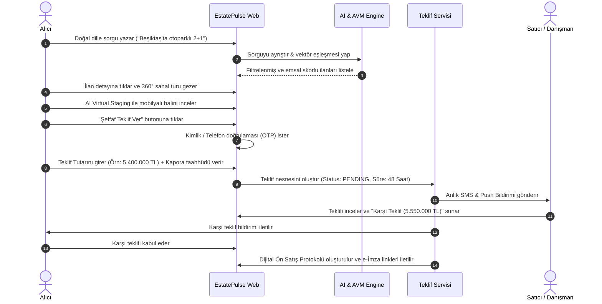
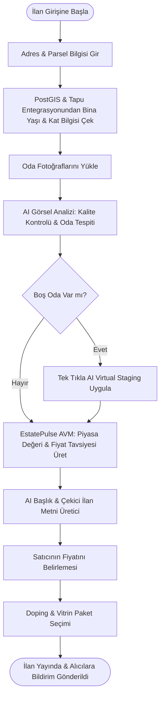
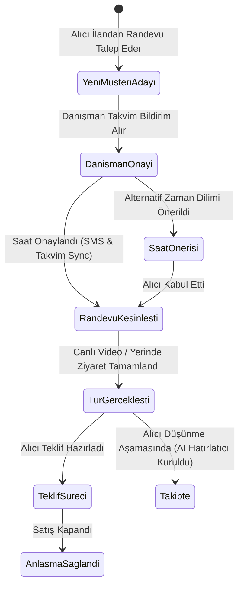

# 🎨 EstatePulse - UI/UX Hiyerarşisi, Tasarım Sistemi ve Kullanıcı Akışları (User Flows)

Bu doküman; EstatePulse platformunun bilgi mimarisini, ekran hiyerarşisini, kullanıcı deneyimi (UX) felsefesini ve uçtan uca kullanıcı akışlarını detaylandırmaktadır.

---

## 1. Tasarım Sistemi ve UX İlkeleri (Design Philosophy)

- **Netlik ve Veri Şeffaflığı:** Fiyat manipülasyonunu ve sahte ilanları engelleyen, veriyi (fiyat geçmişi, emsal analizi, AVM güven aralığı) gizlemeden sunan radikal şeffaflık.
- **Bilişsel Yükün Azaltılması (Zero Cognitive Friction):** Karmaşık onlarca filtre kutucuğu yerine tek bir akıllı NLP arama çubuğu ve harita üzerinden doğrudan poligon çizerek alan seçebilme.
- **Duygusal Bağ ve Güven (Emotional Trust):** Açık ve koyu mod desteği, sıcak mermer-bej ve lacivert-slate kurumsal renk paleti, onaylanmış kimlik rozetleri (Verified Badges).
- **Mikro Etkileşimler:** Framer Motion ile kart geçişleri, 3D oda çevirme efektleri, "Öncesi / Sonrası" (Before/After) mobilyalama kaydırıcıları.

---

## 2. Sayfa Hiyerarşisi & Ekran Detayları



---

### 2.1. Ana Sayfa (Homepage Wireframe Mimarisi)

1. **Header / Navigasyon:**
   - **Sol:** EstatePulse Logo + Şehir Seçici (İstanbul, Ankara, İzmir, Antalya, Bodrum).
   - **Orta:** Satılık | Kiralık | Projeler | AI Değerleme | Yaşam Haritası.
   - **Sağ:** İlan Ver (+ AI Destekli) | Favorilerim | Bildirimler | Profil / Giriş.

2. **Hero Bölümü (Smart NLP Search Engine):**
   - Merkezde odaklanan akıllı arama barı.
   - **Dinamik Öneri Hapları (Prompt Pills):**
     - *"Balkonu deniz gören 3+1 Kadıköy daireleri"*
     - *"Metroya 5 dk yürüme mesafesinde sıfır binalar"*
     - *"Yıllık kira çarpanı 15 yıl altı amortisman fırsatları"*
     - *"Havuzlu ve müstakil bahçeli lüks villalar"*
   - Filtre Değiştirici: Fiyat Aralığı, Konut Tipi, Oda Sayısı hızlı seçim popover'ları.

3. **Canlı Piyasa Nabzı (Live Market Pulse Ticker):**
   - Finansal borsa bantları gibi kayan bölgesel fiyat değişimi:
     - `Kadıköy: +%3.2 (Aylık) | m²: 112.500 ₺`
     - `Çankaya: +%2.1 (Aylık) | m²: 54.200 ₺`
     - `Muratpaşa: +%4.8 (Aylık) | m²: 68.000 ₺`

4. **EstatePulse AI Hızlı Değerleme Widget'ı (Home AVM):**
   - *"Evinizin gerçek değerini ve 1 yıllık prim tahminini 10 saniyede öğrenin."*
   - Adres / Sokak gir -> Bina yaşı & Oda sayısı seç -> Yapay zeka tahmini anında hesaplasın.

5. **Küratörlü İlan Koleksiyonları (Curated Feed):**
   - ⚡ **AI Fırsat Algoritması:** Bölge emsallerinin %10+ altında fiyatlanan doğrulanmış ilanlar.
   - 🛋️ **Virtual Staged Evler:** Yapay zeka ile modern döşenmiş boş daireler.
   - 🌟 **Öne Çıkan Prestij Portföyü:** Vitrin ve kurumsal acente ilanları.

6. **Bölgesel Yaşam Rehberi & Trend Mahalleler:**
   - Mahallelerin Yürüyüş Skoru, Okul Başarısı ve Deprem Güvenlik endeksleriyle kartlı gösterimi.

---

### 2.2. İlan Listeleme ve Bölünmüş Harita Arayüzü (Split-Screen Map UI)

- **Sol Panel (%50 Genişlik) - İlan Akışı (Infinite Scroll):**
  - **Sıralama:** Akıllı Eşleşme (AI Match), En Düşük Fiyat, En Yeni, AVM Değerleme İndirim Oranı.
  - **Zengin İlan Kartı Bileşenleri:**
    - Resim galerisi (üzerine gelince slayt geçişi).
    - **AVM Değer Rozeti:** *"Piyasa Değeri: 7.2M ₺ | İlan: 6.8M ₺ (Fırsat İlanı - %6 Avantaj)"*.
    - **Rozetler:** Sanal Tur (360°), AI Staged, e-Devlet Onaylı Tapu, 3 Yatak, 2 Banyo, 135 m².
    - Fiyat düşüş ikonu ve tek tıkla favoriye ekleme.

- **Sağ Panel (%50 Genişlik) - GPU Hızlandırmalı Mapbox Haritası:**
  - **Fiyat Baloncukları (Price Pins):** Yakınlaştıkça kümelenen (cluster) veya tekil fiyatı gösteren interaktif pinler.
  - **Serbest Çizim Aracı (Draw Polygon on Map):** Kullanıcı fareyle veya parmağıyla haritada sınır çizer; o alan dışındaki ilanlar anında gizlenir.
  - **Yaşam Katmanı Düğmeleri (Lifestyle Overlays):**
    - 🚇 *Toplu Taşıma Hatları ve Yürüme Menzili* (İzofon halkaları - 5, 10, 15 dk).
    - 🏫 *Okullar & Başarı Puanları Katmanı*.
    - 🏥 *Sağlık Kuruluşları*.
    - 🛡️ *Zemin & Deprem Dayanıklılık Katmanı*.

---

### 2.3. İlan Detay Sayfası (Property Detail Page Architecture)

```
┌─────────────────────────────────────────────────────────────────────────────┐
│ [← Haritaya Dön]   İlan No: #EP-94821   Paylaş  Favoriye Ekle   Karşılaştır │
├─────────────────────────────────────────────────────────────────────────────┤
│  MEDYA VİTRİNİ & ETKİLEŞİM SEKMELERİ:                                       │
│  [ Fotoğraf Galerisi (32) ]  [ 360° Sanal Tur ]  [ AI Virtual Staging ]     │
│ ┌───────────────────────────────────────┬─────────────────────────────────┐ │
│ │                                       │  [Küçük Foto 1] [Küçük Foto 2]  │ │
│ │      ANA YÜKSEK ÇÖZÜNÜRLÜKLÜ RESİM     │─────────────────────────────────│ │
│ │      VEYA 360 PANORAMİK SANAL GEZİNTİ  │  [Küçük Foto 3] [+28 Fotoğraf]  │ │
│ └───────────────────────────────────────┴─────────────────────────────────┘ │
│                                                                             │
│ ┌───────────────────────────────────────┬─────────────────────────────────┐ │
│ │  SOL KOLON: İLAN DETAY VE ANALİTİK    │  SAĞ KOLON (STICKY): EYLEM KARTI│ │
│ │                                       │                                 │ │
│ │  FİYAT: 6.850.000 ₺ (50.740 ₺/m²)     │  [ 6.850.000 ₺ ]                │ │
│ │  Moda, Caferağa Mah. Kadıköy/İstanbul │  Aidat: 1.200 ₺ | Krediye Uygun │ │
│ │                                       │                                 │ │
│ │  🌟 ESTATEPULSE AI DEĞERLEME KARTI    │  ┌───────────────────────────┐  │ │
│ │  Tahmini Değer: 6.700.000 - 7.100.000 │  │ DANIŞMAN: Ahmet Yılmaz    │  │ │
│ │  Güven Skoru: %94 | Değerinde İlan    │  │ RE/MAX Cadde | ★ 4.9 (42) │  │ │
│ │  1 Yıllık Prim Tahmini: +%38          │  └───────────────────────────┘  │ │
│ │                                       │                                 │ │
│ │  📊 FİYAT GEÇMİŞİ & ENDEKS GRAFİĞİ    │  [ 📅 Canlı / Yüz Yüze Randevu ]│ │
│ │  [Son 12 ay fiyat değişim eğrisi]     │  [ 🤝 Şeffaf Teklif Ver ]       │ │
│ │                                       │  [ 💬 Danışmana WhatsApp Yaz ]  │ │
│ │  🎯 YAŞAM SKORLARI RADARI             │                                 │ │
│ │  - Yürüyüş: 96/100 | Toplu Taşıma: 92 │  KREDİ HESAPLAMA WIDGET'I:      │ │
│ │  - Okul: 88/100   | Yeşil Alan: 74    │  Aylık Taksit: 54.200 ₺ (120 Ay)│ │
│ │                                       │  [Farklı Bankaları Karşılaştır] │ │
│ │  🛋️ VIRTUAL STAGING KARŞILAŞTIRICI   │                                 │ │
│ │  [ Boş Oda <------- Kaydır -------> Eşyalı Modern İskandinav Oda ]        │ │
│ └───────────────────────────────────────┴─────────────────────────────────┘ │
└─────────────────────────────────────────────────────────────────────────────┘
```

---

## 3. Kullanıcı Akışları (User Journeys & State Diagrams)

### 3.1. Akış 1: Alıcının Doğal Dil ile Arama Yapıp Teklif Vermesi



---

### 3.2. Akış 2: Mülk Sahibinin İlan Girişi & AI Asistan Desteği



---

### 3.3. Akış 3: Danışman / Acente Lead Yönetimi & Randevu


